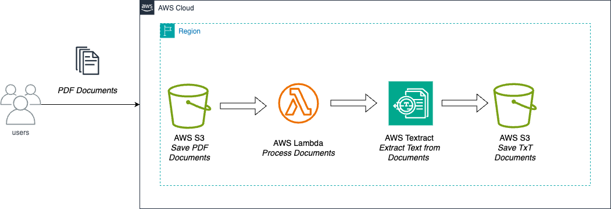

# AWSTextract_extractingText_from_pdf

Extracting text with AWS Textract from PDF files.

Use Case: 

Extracting text from a PDF files and storing its content on a S3 bucket for later processing as a simple text format. In order to accomplish this requirement, I'm using AWS Textract that automatically extract text from different kind of sources using Machine Learning and its capabilities goes beyond an optical character recognition (OCR).

Solution:

The whole solution was made with AWS SDK for Python. Some of the AWS services used and their function are:

* SNS:
* SQS:
* Lambda
* Textract:

Scripts:

This solution was made directly in AWS Lambda. Therefore, there is not "requirement.txt" file with the dependencies. I strongly recommenend to deploy it directly to AWS Lambda to avoid having issues with the require dependencies.
