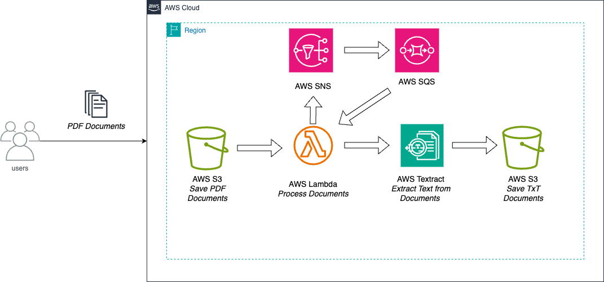

# AWSTextract_extractingText_from_pdf

Extracting text with AWS Textract from PDF files.

This solution was inspired on the AWS document processing solution tutorial and was adapted to my use case [here](https://docs.aws.amazon.com/textract/latest/dg/textract-to-comprehend.html)

Use Case: 

Extracting text from a PDF files and storing its content on a S3 bucket for later processing as a simple text format. In order to accomplish this requirement, I'm using AWS Textract that automatically extract text from different kind of sources using Machine Learning and its capabilities goes beyond an optical character recognition (OCR).

Solution:

The whole solution was made with AWS SDK for Python. Some of the AWS services used and their function are:

* SNS: provide information about the job completion status to an Amazon SQS queue.
* SQS: SQS queue will be polled to obtain the completion status of a job.
* Lambda: It is where the AWS SDK code works.
* Textract: Using Textract on AWS SDK to process PDF documents and converted to Txt.

Scripts:

This solution was made directly in AWS Lambda. Therefore, there is not "requirement.txt" file with the dependencies. I strongly recommenend to deploy it directly to AWS Lambda to avoid having issues with the require dependencies.

On the script folder there are two python scripts:

* detectFileAsync.py: This python script will build the methods that will create all the require services and will make the Async job for our document processing.
* processDocuments.py: This python script will be our entrypoint to our function. From here, all the methods built before will be called.
